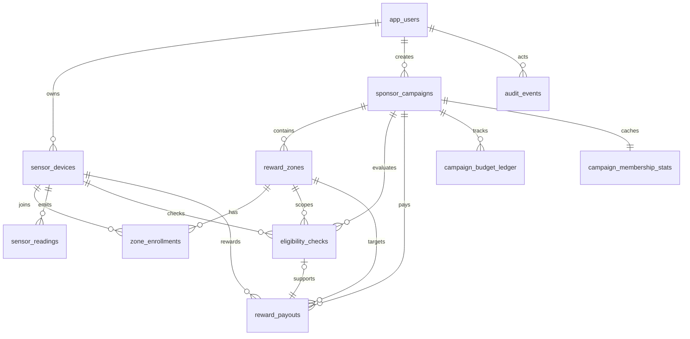

# Database Schema Proposal

This schema is for the hybrid architecture:

- `Supabase`: PostgreSQL, Auth
- `Custom backend`: business logic, eligibility checks, hourly payouts

The database should treat reward calculation as server-owned logic. Frontend clients should not write payout records directly.

## Role Model

- `sensor_owner`: registers and manages sensors
- `sponsor`: creates campaigns and funds reward zones
- `admin`: optional operational role

## Core Tables

### 1. app_users

Application-level profile mapped to Supabase Auth user.

```sql
app_users (
  id uuid primary key,                  -- matches auth.users.id
  role text not null,                   -- sensor_owner | sponsor | admin
  display_name text,
  is_anonymous boolean not null default false,
  created_at timestamptz not null default now(),
  updated_at timestamptz not null default now()
)
```

Constraints:

- `role` should be checked against allowed values

### 2. sensor_devices

Registered air sensors owned by a sensor owner.

```sql
sensor_devices (
  id uuid primary key default gen_random_uuid(),
  owner_user_id uuid not null references app_users(id),
  external_device_id text not null,     -- PurpleAir id or external provider id
  provider text not null default 'purpleair',
  nickname text,
  install_lon double precision,
  install_lat double precision,
  status text not null default 'active',
  last_seen_at timestamptz,
  created_at timestamptz not null default now(),
  updated_at timestamptz not null default now()
)
```

Constraints:

- unique `(provider, external_device_id)`
- `status` should be checked against allowed values, for example `active`, `paused`, `retired`

### 3. sponsor_campaigns

Reward campaign owned by a sponsor.

```sql
sponsor_campaigns (
  id uuid primary key default gen_random_uuid(),
  sponsor_user_id uuid not null references app_users(id),
  name text not null,
  description text,
  status text not null default 'draft',
  hourly_reward_amount numeric(12,2) not null,
  budget_limit numeric(12,2) not null,
  reserved_budget numeric(12,2) not null default 0,
  spent_budget numeric(12,2) not null default 0,
  start_at timestamptz,
  end_at timestamptz,
  created_at timestamptz not null default now(),
  updated_at timestamptz not null default now()
)
```

Constraints:

- `status` should be checked against allowed values, for example `draft`, `active`, `paused`, `ended`
- `hourly_reward_amount >= 0`
- `budget_limit >= 0`

### 4. reward_zones

Geographic targets under a campaign.

```sql
reward_zones (
  id uuid primary key default gen_random_uuid(),
  campaign_id uuid not null references sponsor_campaigns(id),
  name text not null,
  center_lon double precision not null,
  center_lat double precision not null,
  radius_meters integer not null,
  is_active boolean not null default true,
  created_at timestamptz not null default now(),
  updated_at timestamptz not null default now()
)
```

Constraints:

- `radius_meters > 0`
- longitude and latitude should be range-checked

### 5. zone_enrollments

Explicit enrollment of a device into a reward zone.

```sql
zone_enrollments (
  id uuid primary key default gen_random_uuid(),
  zone_id uuid not null references reward_zones(id),
  device_id uuid not null references sensor_devices(id),
  status text not null default 'active',
  joined_at timestamptz not null default now(),
  left_at timestamptz,
  created_at timestamptz not null default now()
)
```

Constraints:

- unique `(zone_id, device_id)`
- `status` should be checked against allowed values, for example `active`, `left`, `blocked`

### 6. sensor_readings

Latest imported or periodically synced sensor state snapshots used for eligibility.

```sql
sensor_readings (
  id bigserial primary key,
  device_id uuid not null references sensor_devices(id),
  observed_at timestamptz not null,
  observed_lon double precision,
  observed_lat double precision,
  pm25 double precision,
  humidity double precision,
  temperature_c double precision,
  is_online boolean not null,
  ingestion_source text,
  created_at timestamptz not null default now()
)
```

Notes:

- This can become high-volume. Partitioning by time may be needed later.

### 7. eligibility_checks

Audit log for hourly reward qualification decisions.

```sql
eligibility_checks (
  id uuid primary key default gen_random_uuid(),
  campaign_id uuid not null references sponsor_campaigns(id),
  zone_id uuid not null references reward_zones(id),
  device_id uuid not null references sensor_devices(id),
  check_hour timestamptz not null,      -- normalized to the payout hour
  is_eligible boolean not null,
  reason_code text not null,            -- online_ok | out_of_zone | offline | budget_exhausted ...
  detail jsonb not null default '{}'::jsonb,
  created_at timestamptz not null default now()
)
```

Constraints:

- unique `(campaign_id, zone_id, device_id, check_hour)`

### 8. reward_payouts

Immutable payout ledger. Only backend jobs should insert rows.

```sql
reward_payouts (
  id uuid primary key default gen_random_uuid(),
  campaign_id uuid not null references sponsor_campaigns(id),
  zone_id uuid not null references reward_zones(id),
  device_id uuid not null references sensor_devices(id),
  payout_hour timestamptz not null,
  amount numeric(12,2) not null,
  status text not null default 'recorded',
  eligibility_check_id uuid references eligibility_checks(id),
  created_at timestamptz not null default now()
)
```

Constraints:

- unique `(campaign_id, zone_id, device_id, payout_hour)`
- `amount >= 0`
- `status` should be checked against allowed values, for example `recorded`, `settled`, `reversed`

### 9. campaign_budget_ledger

Budget accounting trail for each sponsor campaign.

```sql
campaign_budget_ledger (
  id uuid primary key default gen_random_uuid(),
  campaign_id uuid not null references sponsor_campaigns(id),
  entry_type text not null,             -- funding | reserve | payout | release | adjustment
  amount numeric(12,2) not null,
  reference_type text,                  -- payout | manual | system
  reference_id uuid,
  note text,
  created_at timestamptz not null default now()
)
```

Notes:

- This table should be append-only.
- Negative and positive amounts are both valid depending on accounting convention.

## Suggested Supporting Tables

### 10. campaign_membership_stats

Cached aggregates for sponsor dashboard speed. Optional, can be materialized later.

```sql
campaign_membership_stats (
  campaign_id uuid primary key references sponsor_campaigns(id),
  active_zone_count integer not null default 0,
  active_device_count integer not null default 0,
  last_computed_at timestamptz
)
```

### 11. audit_events

Tracks sensitive changes such as zone edits and budget updates.

```sql
audit_events (
  id uuid primary key default gen_random_uuid(),
  actor_user_id uuid references app_users(id),
  entity_type text not null,
  entity_id uuid not null,
  action text not null,
  before_state jsonb,
  after_state jsonb,
  created_at timestamptz not null default now()
)
```

## Relationships



## Access Control Guidance

### Sensor Owner

- Can read their own `sensor_devices`
- Can read their own `zone_enrollments` through owned devices
- Can read their own `reward_payouts`
- Cannot write `reward_payouts`, `eligibility_checks`, or budget tables

### Sponsor

- Can read and update their own `sponsor_campaigns`
- Can read and update `reward_zones` under their own campaigns
- Can read `reward_payouts` and `campaign_budget_ledger` for their own campaigns
- Cannot modify sensor ownership or write payout rows

### Backend Service Role

- Can insert `eligibility_checks`
- Can insert `reward_payouts`
- Can insert `campaign_budget_ledger`
- Can update derived budget totals in `sponsor_campaigns`

## Indexing Recommendations

Create these early:

```sql
create index idx_sensor_devices_owner_user_id
  on sensor_devices (owner_user_id);

create index idx_sponsor_campaigns_sponsor_user_id
  on sponsor_campaigns (sponsor_user_id);

create index idx_reward_zones_campaign_id
  on reward_zones (campaign_id);

create index idx_zone_enrollments_device_id
  on zone_enrollments (device_id);

create index idx_zone_enrollments_zone_id
  on zone_enrollments (zone_id);

create index idx_sensor_readings_device_id_observed_at
  on sensor_readings (device_id, observed_at desc);

create index idx_eligibility_checks_campaign_hour
  on eligibility_checks (campaign_id, check_hour desc);

create index idx_reward_payouts_campaign_hour
  on reward_payouts (campaign_id, payout_hour desc);

create index idx_reward_payouts_device_hour
  on reward_payouts (device_id, payout_hour desc);

create index idx_campaign_budget_ledger_campaign_created
  on campaign_budget_ledger (campaign_id, created_at desc);
```

## PostGIS Recommendation

Because reward zones are radius-based, move to `PostGIS` when implementing real matching:

- store zone center as `geography(Point, 4326)`
- optionally store sensor observed location as `geography(Point, 4326)`
- use `ST_DWithin` for radius checks

Until then, the `center_lon`, `center_lat`, and `radius_meters` columns are enough for MVP.

## First Migration Order

Recommended creation order:

1. `app_users`
2. `sensor_devices`
3. `sponsor_campaigns`
4. `reward_zones`
5. `zone_enrollments`
6. `sensor_readings`
7. `eligibility_checks`
8. `reward_payouts`
9. `campaign_budget_ledger`
10. `campaign_membership_stats` and `audit_events` if needed

## MVP Cut

If you want the smallest viable schema for the first build, start with:

- `app_users`
- `sensor_devices`
- `sponsor_campaigns`
- `reward_zones`
- `zone_enrollments`
- `sensor_readings`
- `reward_payouts`

Then add:

- `eligibility_checks`
- `campaign_budget_ledger`
- `audit_events`

once payout rules stabilize.
