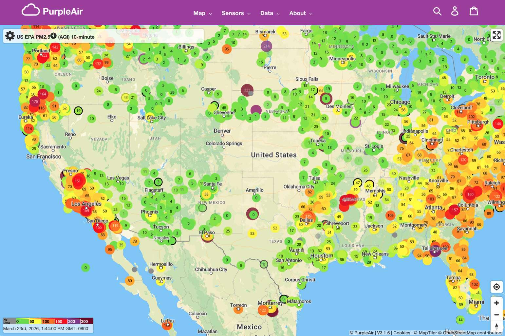
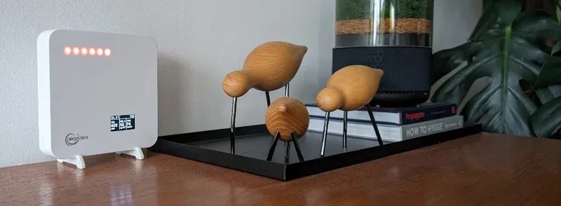
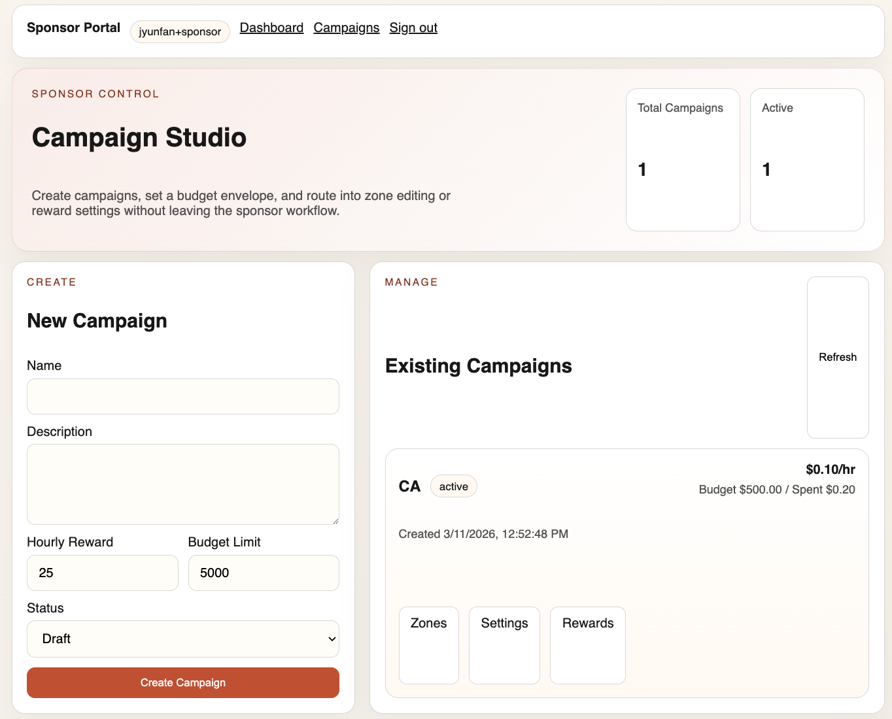
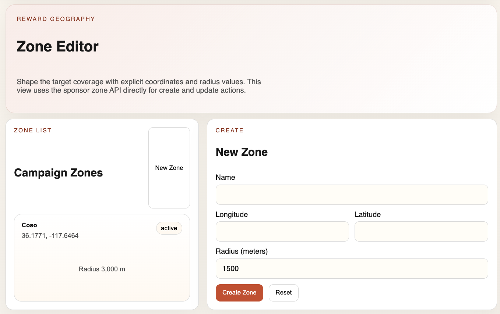
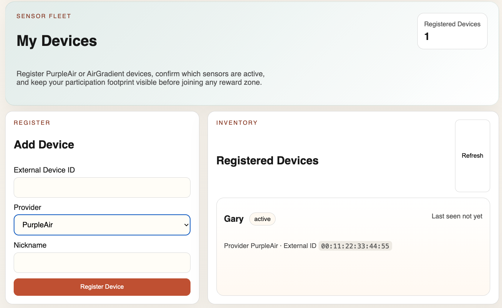
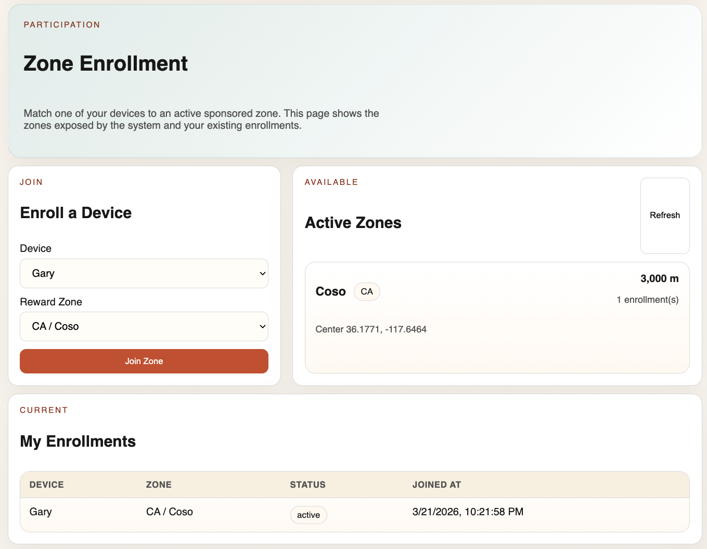
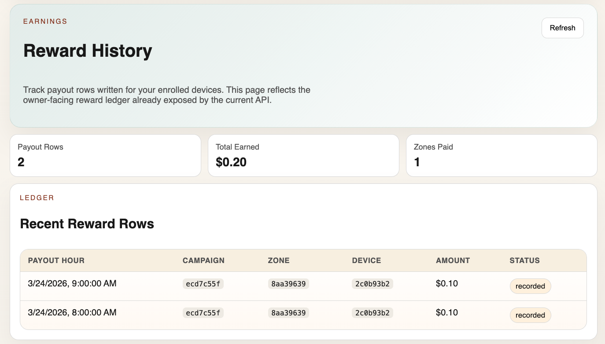

# Incentivizing Decentralized IoT Networks to Enhance Smoke Detector Coverage in the Wildland-Urban Interface

- Jyun-Fan Tsai
- Dorgie LLC.
- 2026.03.26 at 4th International Smoke Symposium
---

<!-- presenter-notes: Wildfire smoke often reaches communities before flames do, but sensing and connectivity coverage do not always exist where they are most needed. -->

<!-- speech-script: In this talk, I focus on smoke monitoring in the wildland-urban interface, where communities are exposed early but sensing coverage is often incomplete. My main argument is that the bottleneck is not only sensing hardware. It is also how we coordinate deployment, connectivity, and maintenance in the right places. -->

<!-- audience-question: Why is wildfire smoke monitoring the right place to introduce a new incentive mechanism instead of simply expanding existing public monitoring networks? -->

<!-- slide-id: Slide 2 - Why This Matters (Problem Context) -->
# Wildfire Smoke Risk Is Expanding Faster Than Monitoring Coverage

- Wildland-Urban Interface (WUI) areas combine high fire risk with growing populations
- Smoke exposure causes health risks even when fire is far from homes
- Early smoke detection and local air quality visibility support public response
- Coverage gaps are common in semi-rural and edge communities

<!-- presenter-notes: The challenge is not only sensor technology; it is where sensors are deployed and whether they stay online. -->
<!-- speech-script: Wildfire smoke risk is growing across WUI regions, but monitoring coverage does not expand at the same rate. Even when sensors are available, they are not always placed in high-risk zones, and they do not always remain online. That is the practical gap this work is trying to address. -->
<!-- audience-question: Do we have evidence that current coverage gaps are large enough to justify a new coordination system? -->

---

<!-- slide-id: PurpleAir Map -->

---

<!-- slide-id: Slide 3 - Current Gaps in Monitoring -->
# What Is Missing in Existing Approaches?

- Government-operated regulatory air quality stations, such as EPA and local agency monitoring stations: high quality, but expensive and sparse
- Community sensors (e.g., PurpleAir): large in scale, but placement is still not optimized for risk coverage
- PurpleAir currently advertises about 35,000 sensors worldwide, yet the network grows where volunteers buy devices, not where smoke exposure risk is highest
- AirGradient also reports about 30,000 users, which further shows that community sensing is growing, but not necessarily in the highest-priority smoke exposure areas
- Network connectivity is uneven (WiFi / cellular / hotspot availability varies)
- No strong mechanism to coordinate private devices for public monitoring goals

<!-- presenter-notes: We have pieces of the system, but not a mechanism to align them. -->
<!-- speech-script: Existing public monitoring stations provide trusted data, but they are sparse and expensive. Community networks such as PurpleAir and AirGradient are much larger, but their growth is driven by where people choose to buy and install devices, not by where coverage is most needed. So the unresolved problem is coordination, not just sensor availability. -->
<!-- audience-question: If PurpleAir and public stations already exist, what exact failure remains unsolved? -->

---

<!-- slide-id: Slide 4 - Core Idea -->
# Use Incentives to Coordinate Sensor and Network Contributions

- Create a reward mechanism that targets **specific high-priority locations**
- Reward people who bring their own sensors online
- Reward network providers who contribute connectivity (WiFi / 5G / hotspot / gateway)
- Allow a sponsor (city, NGO, insurer, community group) to fund coverage expansion

<!-- presenter-notes: Incentives should reward verified public monitoring contribution, not just device ownership. -->
<!-- speech-script: My proposal is to use incentives to steer private sensing and connectivity resources toward public monitoring goals. Instead of rewarding ownership alone, the system rewards actual contribution in priority locations. That means location, uptime, and usable data all matter. -->
<!-- audience-question: Why do we need incentives at all? Would volunteers or public agencies not be sufficient? -->

---

<!-- slide-id: Slide 4A - Example Community Sensors -->
# Community Sensors Already Exist

| PurpleAir Zen | AirGradient ONE |
|:--:|:--:|
|  |  |
| **USD 299** | **USD 230** |

- Off-the-shelf community sensors are already available at consumer-accessible price points
- The bottleneck is coordinated deployment, connectivity, and uptime in priority smoke-risk areas

<!-- presenter-notes: The point of this slide is not product comparison. It is to show that basic hardware availability is not the limiting factor. -->
<!-- speech-script: This slide helps make the argument concrete. Devices such as PurpleAir and AirGradient are already commercially available, and their prices are within a range that community groups, schools, households, or sponsors could realistically purchase. So the central question is not whether the hardware exists. The central question is how to coordinate where these devices go, who keeps them online, and who pays for that public-value contribution. -->

---

<!-- slide-id: Slide 5 - Roles in the Ecosystem -->
# Who Participates?

- **Reward Sponsor**
  - Defines target area and budget
  - Pays for coverage in priority zones
- **Sensor Owner**
  - Deploys and maintains a sensor (e.g., PurpleAir-like node)
  - Keeps it online and transmitting
- **Network Provider**
  - Provides reliable data backhaul (WiFi / 5G / hotspot / LoRa gateway)
  - Enables sensor data delivery
- **Platform / Coordinator**
  - Publishes tasks, verifies contribution, calculates rewards

<!-- presenter-notes: The platform is the coordination layer, but the infrastructure can remain community-owned. -->
<!-- speech-script: There are four main actors in this model. Sponsors define where coverage is needed and fund rewards. Sensor owners and network providers contribute infrastructure, while the platform coordinates tasks, verification, and payout logic. -->
<!-- audience-question: What motivates each actor to keep participating after the initial novelty wears off? -->

---

<!-- slide-id: Slide 6 - System Architecture (End-to-End) -->
# How the System Works

1. Sponsor defines a monitoring objective (location, duration, budget, priority map)
2. Platform publishes reward opportunities for under-covered zones
3. Sensor owners deploy or activate sensors in target areas
4. Network providers offer connectivity for data transmission
5. Platform verifies location, uptime, and data quality
6. Rewards are distributed based on measured contribution

<!-- presenter-notes: Data flow for diagram: Sensor -> Network -> Platform -> Dashboard / Alerts / Public AQ tools -->
<!-- speech-script: Operationally, the workflow is straightforward. A sponsor defines a target area and budget, the platform publishes the opportunity, participants contribute sensing and connectivity, and the platform verifies performance before distributing rewards. The architecture is simple on paper, but the hard part is making verification credible. -->
<!-- audience-question: Where is the hardest technical bottleneck in this pipeline: device onboarding, network reliability, or reward verification? -->

---

<!-- slide-id: Slide 7 - Incentive Design (Three Reward Layers) -->
# Reward Components

- **A. Placement Reward**
  - Higher reward for sensors placed in coverage gaps or high-risk zones
  - Encourages deployment to where data is most valuable

- **B. Online / Uptime Reward**
  - Rewards consistent operation and regular reporting
  - Prevents “deploy once, then go offline”

- **C. Connectivity Reward**
  - Rewards network providers for stable, low-latency data transport
  - Recognizes that sensing depends on communication infrastructure

<!-- presenter-notes: This aligns deployment, operation, and connectivity incentives at the same time. -->
<!-- speech-script: I separate rewards into three layers because each one addresses a different failure mode. Placement rewards solve where sensors go, uptime rewards solve whether they stay active, and connectivity rewards solve whether data can actually reach the platform. Together, these layers align incentives across the full monitoring chain. -->
<!-- audience-question: Could multiple reward layers make the system too complicated for ordinary participants to understand? -->

---

<!-- slide-id: Slide 8 - Example Reward Formula -->
# A Practical Reward Calculation (Illustrative)

**Total Reward = Base × Location Score × Data Quality Score × Uptime Score + Connectivity Bonus**

- **Location Score**
  - Is the sensor in a target zone?
  - Does it reduce a coverage gap?
- **Data Quality Score**
  - Valid range checks, calibration status, consistency with nearby nodes
- **Uptime Score**
  - Online rate, reporting frequency, continuity during target periods
- **Connectivity Bonus**
  - Reliable transmission, latency, availability of network service

<!-- presenter-notes: The exact weights can be tuned by sponsor goals such as public health, emergency response, or cost control. -->
<!-- speech-script: This formula is only an example, but it makes the design logic explicit. A useful reward should depend on where the sensor is, whether the data looks valid, whether the device stays online, and whether connectivity is reliable. Different sponsors can tune these weights depending on whether they prioritize public health coverage, emergency responsiveness, or budget efficiency. -->
<!-- audience-question: How do you choose the weights without creating unfair payouts or unintended gaming behavior? -->

---

<!-- slide-id: Slide 9 - Verification and Anti-Gaming -->
# How to Prevent Abuse and Low-Value Participation

- **Location verification**
  - Initial verification: phone GPS
  - GPS metadata, installation confirmation, periodic checks
- **Data validation**
  - Outlier detection, cross-check with nearby sensors, drift monitoring
- **Uptime verification**
  - Timestamp continuity and packet delivery records
- **Penalty rules**
  - Reduced rewards or suspension for repeated invalid submissions

<!-- presenter-notes: A reward system without verification will optimize for gaming, not coverage. -->
<!-- speech-script: Verification is essential because incentives change behavior. If the system only pays for registration, people will optimize for registration. So the first step in location verification is phone GPS during onboarding, followed by installation confirmation and periodic checks. If the system pays for verified contribution, then the platform also needs credible checks on data quality, uptime, and network service. -->
<!-- audience-question: How strong is the verification in practice if users can register anonymously? -->

---

<!-- slide-id: Slide 10 - Prototype Website -->
# A Web Platform for Incentive-Based Sensor Participation

- Sensor owners can register their devices
- Sponsors can define a target geographic area and assign a reward budget
- The platform matches active sensors to sponsored target zones
- The system verifies eligible participation and distributes rewards every hour

<!-- presenter-notes: Key workflow is Register device -> Join target area -> Stay online -> Receive hourly rewards. -->
<!-- speech-script: One implementation path is a web platform that makes participation simple. In the demo, I would first show the sensor-owner view, where a user signs in with their email and registers a PurpleAir device. Next, I would switch to the sponsor view and show how a sponsor selects a target region, defines a reward budget, and opens a campaign for that area. Then I would show the map or dashboard view, where the platform matches active sensors to sponsored zones and displays which devices are eligible for rewards. Finally, I would show the hourly reward cycle, where the system checks participation status, verifies eligible contribution, and distributes rewards. This turns the incentive model into an operational workflow instead of just a conceptual framework. -->
<!-- audience-question: Why should sponsors trust an anonymous, hourly reward system with real money or real budgets? -->

---

<!-- slide-id: Slide 10A - Sponsor Workflow Screens -->
# Sponsor Workflow: Create a Campaign and Define Target Zones

| Campaign setup | Zone editor |
|:--:|:--:|
|  |  |

- Sponsors create a campaign, set reward rate, and manage budget from one workflow
- Zone editing makes the target geography explicit with coordinates and radius values
- This is the control point where coverage goals become machine-readable reward rules

<!-- presenter-notes: This slide makes the sponsor workflow concrete: first define the campaign, then define where incentives should apply. -->
<!-- speech-script: Here the abstract sponsor role becomes a real workflow. On the left, the sponsor creates a campaign, sets a reward rate, and defines the budget envelope. On the right, the sponsor translates policy intent into explicit geography by creating target zones with coordinates and radius values. This is important because the reward system only works if the target coverage area is unambiguous and operational. -->
<!-- audience-question: How easy is it for a sponsor to define useful target zones without GIS expertise? -->

---

<!-- slide-id: Slide 10B - Sensor Owner Onboarding -->
# Sensor Owner Workflow: Register a Device and Join a Zone

| Device registration | Zone enrollment |
|:--:|:--:|
|  |  |

- The owner registers an existing PurpleAir or AirGradient device
- The platform shows which sponsored zones are available for enrollment
- Participation is tied to a real device and a visible target zone, not just an account

<!-- presenter-notes: This is the onboarding step for contributors: bring an existing sensor, then opt into a sponsored zone. -->
<!-- speech-script: For the sensor owner, the workflow is equally straightforward. First the participant registers a device that already exists in the field. Then the platform shows active sponsored zones and allows the user to enroll that device into a specific target area. This keeps the participation flow simple while still tying rewards to a concrete sensor and a concrete zone. -->
<!-- audience-question: What stops a user from registering many inactive devices or repeatedly switching zones to chase rewards? -->

---

<!-- slide-id: Slide 10C - Sensor Owner Rewards -->
# Sensor Owner Workflow: Reward History Builds Trust

- Owners can see payout rows, participating zones, and total earnings
- The ledger view helps explain why rewards were issued and whether participation stayed eligible
- Transparent reward history supports retention and reduces disputes about payouts

<!-- presenter-notes: The reward screen is not just for UX polish; it is part of making the incentive mechanism legible and trustworthy. -->
<!-- speech-script: The final piece of the user workflow is reward visibility. Participants need to see that their effort turned into a recorded payout, and they need enough detail to understand when and why the system paid them. A visible reward ledger is important because trust in the mechanism is part of whether contributors stay engaged over time. -->
<!-- audience-question: How detailed does the payout ledger need to be before it becomes understandable enough for ordinary users? -->

---

<!-- slide-id: Slide 11 - Expected Impact and Use Cases -->
# Why This Matters Beyond One Pilot

- Improves smoke monitoring in underserved WUI communities
- Adds resilience through distributed, community-participating infrastructure
- Helps agencies and emergency managers see local conditions sooner
- Creates a path to scale with limited public budgets
- Can generalize to other environmental monitoring:
  - Heat stress
  - Flood sensing
  - Neighborhood air quality

<!-- audience-question: Is this actually scalable, or does it only work in a small pilot with a highly engaged community? -->
<!-- speech-script: After the demo, the main takeaway is that the system is not just a map of sensors. It is a coordination mechanism that connects sponsors, sensor owners, and network providers through a concrete workflow. If this works, the value extends beyond a single pilot. It could improve smoke coverage in underserved communities, add resilience through distributed infrastructure, and potentially support other environmental sensing tasks such as heat, flooding, or neighborhood air quality. The broader point is that the same coordination model may generalize across domains. -->

---

<!-- slide-id: Slide 12 - Challenges and Open Questions -->
# What Still Needs Careful Design

- Who funds rewards long-term, and how sustainable is the budget?
- How do we protect privacy while verifying location and contribution?
- How should rewards differ across WiFi, 5G, and LoRa-like networks?
- How do we ensure equity (not only rewarding already well-connected areas)?
- How do we integrate with public agencies and trusted alert systems?

<!-- presenter-notes: Technical feasibility is only one part; governance and incentive design determine real-world success. -->
<!-- speech-script: There are still real open questions here. Funding, privacy, fairness across network types, and integration with public institutions all affect whether the system is deployable in practice. So this should be viewed as a combined IoT, governance, and mechanism design problem. -->
<!-- audience-question: Which of these open problems is the biggest blocker to real deployment today? -->

---

<!-- slide-id: Slide 13 - Conclusion -->
# Takeaways

- The main bottleneck is not only sensing hardware, but coordinated deployment and connectivity
- A multi-role incentive mechanism can align private resources with public monitoring goals
- Rewarding both sensors and networks can improve coverage where it matters most
- This is a mechanism-design problem as much as an IoT problem

<!-- presenter-notes: If we can reward the right contribution in the right place, community-owned infrastructure can become a practical layer of wildfire smoke resilience. -->
<!-- speech-script: To conclude, the central bottleneck is coordination. A well-designed incentive mechanism can align sponsors, sensor owners, and network providers around measurable public monitoring goals. If that alignment works, decentralized infrastructure can become a practical complement to existing smoke monitoring systems. -->
<!-- audience-question: What is the minimum proof you still need before claiming this is a viable deployment model rather than just a concept? -->

---

<!-- slide-id: Slide 14 - Q&A -->
# Questions?

Thank you
- Contact: jyunfan@dorgie.com / lab website

**Useful tools for this presentation**
- marp.app - Markdown to Slides

<!-- presenter-notes: Invite the audience to challenge the incentive model, the verification model, or the operational feasibility. -->
<!-- speech-script: I would be especially interested in feedback on three parts of this proposal: the incentive design, the verification model, and the operational path to deployment. -->

---

<!-- slide-id: Optional Appendix (if asked)
**Possible Metrics for Future Experiments**

- Coverage utility score (weighted by population + risk)
- Mean time to first smoke signal in target zones
- Reward cost per unit coverage improvement
- False positive / false negative rates
- Retention rate of sensor owners and network providers
-->

<!-- audience-question: Which metric would most clearly show that incentives outperform simple flat subsidies or volunteer deployment? -->
<!-- speech-script: In future evaluations, I would focus on metrics that reflect actual public value rather than raw device counts. That includes coverage improvement in priority zones, time to first useful smoke signal, cost per effective sensing point, and participant retention over time. -->
